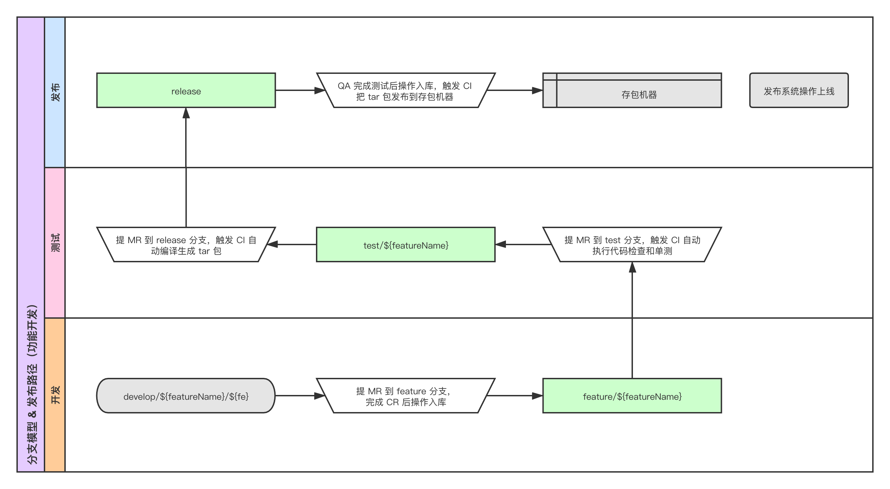
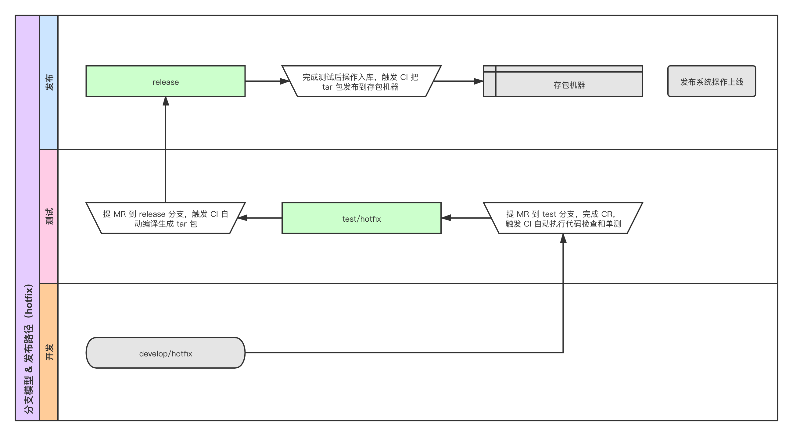

# 分支模型和发布路径

## 目标

针对产品迭代诉求，设计一种合理的代码发布路径和集成方式。

## 产品迭代诉求

* 支持多条线并行，如：核心功能重构、固定双周迭代发布等等。
* 同一功能支持多人协作开发。
* 已经完成开发的功能可以选择性发布。

## 详细设计

**功能开发**

**hotfix**

### 分支介绍

| 分支 | 描述 |
| :-- | :-- |
| `feature/${featureName}` | 针对 `具体 feature` 的分支，用于整合参与 feature 开发的各个工程师的代码，`featureName` 可以描述独立发布的大功能，也可以是某个具体的发布日期。 |
| `develop/${featureName}/${fe}` | 针对 `具体 feature` 的 `开发者` 分支，建议将每天新增的分支内容提 Merge Request 到 `feature/${featureName}` 分支，高频提交可以减少解决冲突和 CR 的工作量。 |
| `test/${featureName}` | feature 对应的测试分支，也可以同时整合多个 `feature/${featureName}` 分支进行测试，视具体测试计划而定。 |
| `develop/hotfix` | 专门用于 bug 修复的开发分支。 |
| `test/hotfix` | 专门用于 bug 修复的测试分支。 |
| `release` | 发布分支，始终体现为已完成测试的最新发布代码。 |
| `master` | 稳定分支，`release` 分支发布后线上回归没问题，将 release 分支合入 master 分支。 |

### GitLab CI

上面提到的 `测试分支`、`发布分支`，并非由 QA 直接拿某个分支去测试或者发布，而是通过 GitLab CI 基于某个分支来自动编译生成要测试、发布的资源。

| 触发 CI 的动作 | 描述 |
| :-- | :-- |
| 从 `feature/${featureName}` 提 Merge Request 到 `test/${featureName}`，从 `develop/hotfix` 提 Merge Request 到 `test/hotfix` | 执行代码检查、单元测试，通过后才能操作入库。 |
| 从 `test/${featureName}` 提 Merge Request 到 `release`，从 `test/hotfix` 提 Merge Request 到 `release` | 执行代码编译，生成 tar 包，QA 拿 tar 包去部署测试。 |
| 目标分支为 `release` 的 Merge Request 操作入库 | 把完成测试的 tar 包发布到存包机器。 |

### 发布上线

开发、测试流程的最终产出是一个可靠的 tar 包，发布系统只用关注怎么获取指定系统的 tar 包，并不需要关注背后的开发测试流程和分支模型，同时发布系统也需要具备针对发布物的版本管理、自动回滚的功能。

### 其他

**保持关键分支 commit 的干净**

* 给 GitLab 项目启用 `Fast-forward merge`，默认情况下 Merge Request 入库时会产生一条额外的 commit，启用 `Fast-forward merge` 后将不会产生。
* 提 Merge Request 时选择 `Squash and merge` 选项，可以将多条 commit 合并成一条。

> 皮成，2020.05.23