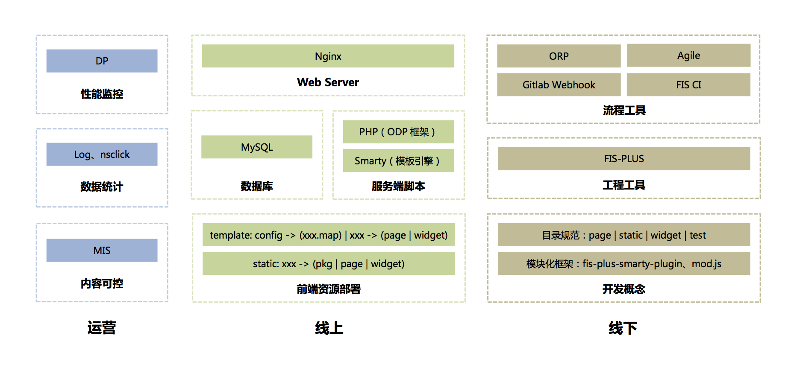
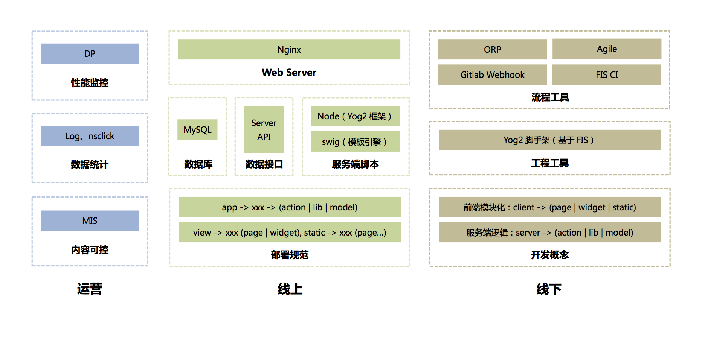

# 前后端概览

> 基于团队研发模式的一些梳理

---

### 技术元素

**开发概念**

* [浅谈前端集成解决方案](https://github.com/fouber/blog/issues/1)
* [前端开发体系建设日记](https://github.com/fouber/blog/issues/2)
* [前端工程与模块化框架](https://github.com/fouber/blog/issues/4)
* [前端工程分享](https://github.com/fouber/blog/blob/master/201505/01.md)
* [前端工程——基础篇](https://github.com/fouber/blog/issues/10)

**工程工具 & 框架**

* [FIS2](http://fex-team.github.io/fis-site/docs/beginning/getting-started.html)
* [FIS3](http://fis.baidu.com/)
* [FIS-PLUS](http://fex-team.github.io/fis-plus/)
* [FIS编译过程运行原理](http://fex-team.github.io/fis-site/docs/more/fis-base.html)
* [FIS插件调用机制](http://fex-team.github.io/fis-site/docs/more/how-plugin-works.html)
* [FIS插件扩展点列表](http://fex-team.github.io/fis-site/docs/more/extension-point.html)
* [mod.js](https://github.com/fex-team/mod)
* [fis-plus-smarty-plugin](https://github.com/fex-team/fis-plus-smarty-plugin)

**流程工具**

* ORP(内部平台)
* Agile(内部平台)
* FIS CI(内部平台)
* [Gitlab Webhook](https://gitlab.com/gitlab-org/gitlab-ce/blob/master/doc/web_hooks/web_hooks.md)

**Web Server**

* [Nginx文档](http://tengine.taobao.org/nginx_docs/cn/docs/)

**MySQL**

* [21分钟 MySQL 入门教程](http://www.cnblogs.com/mr-wid/archive/2013/05/09/3068229.html)

**PHP**

* [PHP手册](http://php.net/manual/zh/)
* [Smarty手册](http://www.smarty.net/docs/zh_CN/)
* ODP(内部框架)

**Node**

* [Node文档](https://nodejs.org/api/)
* [Node入门](http://www.nodebeginner.org/index-zh-cn.html)
* [Express](http://expressjs.com/)
* [YOG2](http://fex.baidu.com/yog2/)
* [Swig](http://yangxiaofu.com/swig/)
* [深入浅出Node.js](https://www.amazon.cn/%E6%B7%B1%E5%85%A5%E6%B5%85%E5%87%BANode-js-%E6%9C%B4%E7%81%B5/dp/B00GOM5IL4/ref=sr_1_1?ie=UTF8&qid=1479998202&sr=8-1&keywords=node)

**运营相关**

* DP(内部平台)
* CRM(内部平台)
* MIS(内部平台)

> 创建：皮成，2016-11-17
