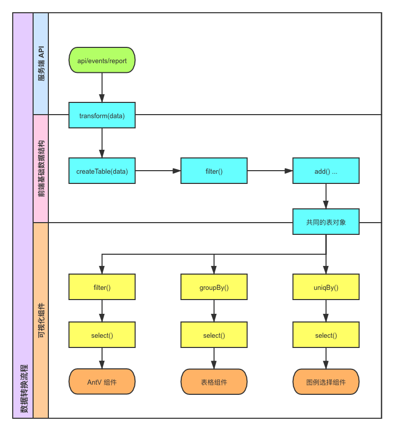

# 可视化前端基础数据结构

基础数据结构用于统一各种服务端数据到可视化数据的转换流程。

## 数据转换流程



从数据到 UI 的过程可以理解为一个管道，管道中每个环节的处理都是为了让下一个环节更简单，这样设计的好处是：

- 具体到可视化需要作的数据处理逻辑会尽量简化。
- 管道前面的环节可以共用，也可以做一些统一的优化。

整体流程包含三个部分：

- transform，用于将具体的业务数据处理成表结构要求的数据。
- createTable，将表结构数据创建为表对象，调用表对象上的数据处理方法作各种全局的处理。
- 可视化，各个可视化组件依赖共同的表对象，针对各自的可视化需求可以在表对象上再次调用相关的处理方法，各个处理方法调用后会返回一个新的实例，最终通过 select 方法获取到各自需要的数据。

## 前端基础数据结构

数据转换方法用于将各种服务端 API 返回的数据转换成基础数据结构，不同的 API 需要有对应的转换方法。

基础数据结构就是一个表结构，比如事件分析 API 返回的数据会转换成两张表：

#### 明细表

| measures | by_fields | $country | $province | date | value |
| :--- | :--- | :--- | :--- | :--- | :--- |
| CRM操作的总次数 | 中国,浙江省 | 中国 | 浙江省 | 2020-03-02 00:00:00 | 853 |
| 文档操作的总次数 | 中国,浙江省 | 中国 | 浙江省 | 2020-03-02 00:00:00 | 833 |
| CRM操作的总次数 | 中国,浙江省 | 中国 | 浙江省 | 2020-03-03 00:00:00 | 857 |
| 文档操作的总次数 | 中国,浙江省 | 中国 | 浙江省 | 2020-03-03 00:00:00 | 757 |

#### 合计表

| measures | by_fields | $country | $province | date | value |
| :--- | :--- | :--- | :--- | :--- | :--- |
| CRM操作的总次数 |  |  |  |  | 15667 |
| 文档操作的总次数 |  |  |  |  | 14889 |
| CRM操作的总次数 | 韩国 | 韩国 |  |  | 9989 |
| 文档操作的总次数 | 韩国 | 韩国 |  |  | 9578 |
| CRM操作的总次数 | 韩国,釜山广域市 | 韩国 | 釜山广域市 |  | 893 |
| 文档操作的总次数 | 韩国,釜山广域市 | 韩国 | 釜山广域市 |  | 852 |
| CRM操作的总次数 | 韩国 | 韩国 |  | 2020-03-02 00:00:00 | 1474 |
| 文档操作的总次数 | 韩国 | 韩国 |  | 2020-03-02 00:00:00 | 1415 |
| CRM操作的总次数 | 韩国 | 韩国 |  | 2020-03-03 00:00:00 | 1454 |
| 文档操作的总次数 | 韩国 | 韩国 |  | 2020-03-03 00:00:00 | 1414 |

### 转换方法

```javascript
// 分析模型数据转换方法
import { transform } from '@sc/report-utils';

// 将事件分析 API 返回的数据转为前端基础数据结构
const { detail, rollup } = transform({
  type: 'segmentation',
  meta: {
    measures: [ '提交新密码的总次数', 'App 激活的总次数' ]
  },
  data
});
```

JSON 数据结构如下：
```json
[
  {
    "measure": "CRM操作的总次数",
    "by_values": ["韩国"],
    "event.$Anything.$country": "韩国",
    "event.$Anything.$province": "",
    "date": "2020-03-02 00:00:00",
    "value": 9989
  },
  {
    "measure": "文档操作的总次数",
    "by_values": ["韩国"],
    "event.$Anything.$country": "韩国",
    "event.$Anything.$province": "",
    "date": "2020-03-02 00:00:00",
    "value": 9578
  },
  {
    "measure": "CRM操作的总次数",
    "by_values": ["韩国","釜山广域市"],
    "event.$Anything.$country": "韩国",
    "event.$Anything.$province": "釜山广域市",
    "date": "2020-03-03 00:00:00",
    "value": 893
  },
  {
    "measure": "文档操作的总次数",
    "by_values": ["韩国","釜山广域市"],
    "event.$Anything.$country": "韩国",
    "event.$Anything.$province": "釜山广域市",
    "date": "2020-03-03 00:00:00",
    "value": 852
  }
]
```

### 创建表对象

将符合表结构的数据创建为表对象，基于表对象提供的方法可以对数据进行各种操作，生成符合可视化组件的数据。

```javascript
// 分析模型数据转换方法
import { transform } from '@sc/report-utils';
// 表对象创建方法
import { createTable } from '@sc/database';

// 将事件分析 API 返回的数据转为前端基础数据结构
const { detail, rollup } = transform({
  type: 'segmentation',
  meta: {
    measures: [ '提交新密码的总次数', 'App 激活的总次数' ]
  },
  data
});

// 创建明细表
const detailTable = createTable(detail);
// 创建合计表
const rollupTable = createTable(rollup);
```

#### 表对象 API

表对象上有一系列操作数据的方法。

##### select()

选取表中的数据，除 `select` 方法外，其他方法在执行后均会返回一个新的表对象。

##### add(key, value)

在每条数据中新增字段。

| 参数 | 类型 | 描述 |
| :--- | :--- | :--- |
| key | `string` | 新增的字段名 |
| value | `string` or `function` | 字段值，类型为函数则可以根据每条数据生成返回字段值，传入函数的第 1 个参数为当前数据项，第 2 个参数为元素的索引 |

##### filter(callback)

对数据进行过滤。

| 参数 | 类型 | 描述 |
| :--- | :--- | :--- |
| callback | `function` | 测试表中的每条数据，返回 `true` 保留数据，`false` 不保留数据，传入函数的第 1 个参数为当前数据项，第 2 个参数为元素的索引 |

##### orderBy(key, compareFunction)

根据指定的列对数据进行排序。

| 参数 | 类型 | 描述 |
| :--- | :--- | :--- |
| key | `string` | 字段名 |
| compareFunction | `function=` | 比较函数，与数组 `sort` 方法的使用一致，接收两条比较数据的字段值 |

##### uniqBy(key)

根据指定的列对数据进行去重。

| 参数 | 类型 | 描述 |
| :--- | :--- | :--- |
| key | `string` | 字段名 |

##### groupBy(key)

根据指定的列对数据进行分组。

| 参数 | 类型 | 描述 |
| :--- | :--- | :--- |
| key | `string` | 字段名 |

分组后数据结构如下：

```json
[
  {
    "key": "CRM操作的总次数",
    "items": [
      {
        "measures": "CRM操作的总次数",
        "event.$Anything.$country": "韩国",
        "event.$Anything.$province": "",
        "date": "",
        "value": 9989
      },
      {
        "measures": "CRM操作的总次数",
        "event.$Anything.$country": "韩国",
        "event.$Anything.$province": "釜山广域市",
        "date": "",
        "value": 893
      }
    ]
  },
  {
    "key": "文档操作的总次数",
    "items": [
      {
        "measures": "文档操作的总次数",
        "event.$Anything.$country": "韩国",
        "event.$Anything.$province": "",
        "date": "",
        "value": 9578
      },
      {
        "measures": "文档操作的总次数",
        "event.$Anything.$country": "韩国",
        "event.$Anything.$province": "釜山广域市",
        "date": "",
        "value": 852
      }
    ]
  }
]
```

#### 示例

**获取指标合计值**

```javascript
rollupTable
  // 合计表中没有分组值和时间值的数据
  .filter(item => !item.by_fields && !item.date)
  .select();
```

**生成图例数据**

```javascript
detailTable
  // 按分组名去重
  .uniqBy('by_fields')
  // 按指标名分组
  .groupBy('measures')
  .select();
```

**生成线图数据**

```javascript
chart.data(detailTable
  // 增加格式化后的日期字段
  .add('dateText', item => moment(item.date).format('MM-DD'))
  .select()
);

chart
  .line()
  .position('dateText*value')
  .color('measures')
  .shape('smooth');

chart
  .point()
  .position('dateText*value')
  .color('measures')
  .shape('circle');
```

**生成分层表格数据**

```javascript
const tableData = [];
const map = {};

// 处理成分层表格的数据结构
rollup
  .map(item => {
    // 以指标名为 key 添加值
    item[item.measures] = item.value;
    Reflect.deleteProperty(item, 'measures');
    Reflect.deleteProperty(item, 'value');
  })
  .forEach(item => {
    // 以国家和省份作为每条数据的标识
    const id = `${item.$country}${item.$province}`;
    if (id) {
      // 整合 id 相同的数据
      if (map[id]) {
        // 补充新的指标值
        map[id][item.measures] = item.value;
      } else {
        map[id] = item;
        tableData.push(item);
      }
    }
  });

// 创建表对象
const table = createTable(tableData);

table
  // 按国家分组
  .groupBy('$country')
  .select();
```

> 皮成，2020.03.22